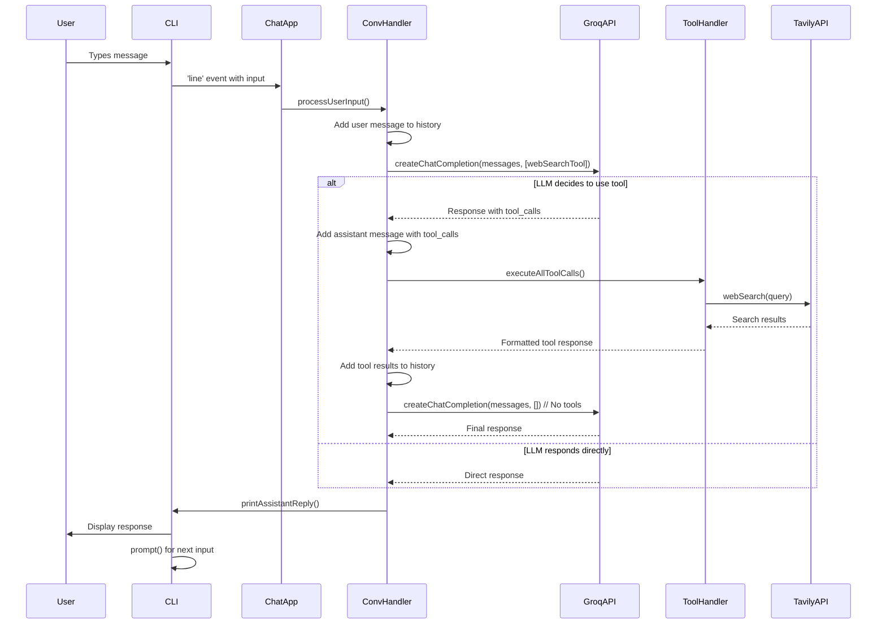

# AI Chat Assistant with Web Search Tool

A modular Node.js application that creates an interactive chat interface with an AI assistant powered by Groq's LLaMA model and enhanced with real-time web search capabilities using Tavily API.

## 📋 Table of Contents

- [Features](#features)
- [Architecture Overview](#architecture-overview)
- [Complete Application Flow](#complete-application-flow)
- [File Structure](#file-structure)
- [Detailed Flow Diagram](#detailed-flow-diagram)
- [Installation](#installation)
- [Configuration](#configuration)
- [Usage](#usage)
- [API Response Structures](#api-response-structures)
- [Error Handling](#error-handling)
- [Development](#development)

## 🚀 Features

- **Interactive CLI Chat Interface** - Beautiful colored terminal interface
- **AI-Powered Conversations** - Uses Groq's LLaMA 3.3 70B model
- **Real-time Web Search** - Integrates Tavily API for up-to-date information
- **Modular Architecture** - Clean, maintainable, and extensible codebase
- **Tool Calling Support** - Extensible system for adding new tools
- **Error Handling** - Robust error handling and user feedback
- **Debug Logging** - Comprehensive logging for development and debugging

## 🏗️ Architecture Overview

The application follows a modular, object-oriented architecture with clear separation of concerns:

```
┌─────────────────┐    ┌─────────────────┐    ┌─────────────────┐
│   CLI Interface │    │ Conversation    │    │  Tool Handler   │
│   (cli.js)      │◄──►│ Handler         │◄──►│ (toolHandler.js)│
│                 │    │ (conversationH) │    │                 │
└─────────────────┘    └─────────────────┘    └─────────────────┘
         ▲                       ▲                       ▲
         │                       │                       │
┌─────────────────┐    ┌─────────────────┐    ┌─────────────────┐
│ Main App        │    │ Groq Client     │    │ Tavily Client   │
│ (toolCalling.js)│    │ (groqClient.js) │    │(tavilyClient.js)│
└─────────────────┘    └─────────────────┘    └─────────────────┘
         ▲                       ▲                       ▲
         │                       │                       │
┌─────────────────┐    ┌─────────────────┐    ┌─────────────────┐
│ Configuration   │    │ Environment     │    │ Tool Config     │
│ (config.js)     │    │ (.env)          │    │(toolConfig.js)  │
└─────────────────┘    └─────────────────┘    └─────────────────┘
```

## 🔄 Complete Application Flow

### 1. **Application Startup** (`toolCalling.js`)

```javascript
// Entry point: toolCalling.js
ChatApplication constructor() {
  ├── Creates CLI interface (cli.js)
  ├── Initializes message array with system message (toolConfig.js)
  ├── Creates ConversationHandler instance
  └── Sets up event handlers
}
```

### 2. **User Input Processing**

```
User types message → CLI captures input → ConversationHandler.processUserInput()
```

### 3. **LLM Request Flow**

```
processUserInput() {
  ├── Add user message to conversation history
  ├── Call Groq API via groqClient.js
  ├── Include webSearch tool definition
  └── Wait for LLM response
}
```

### 4. **Response Processing Decision Tree**

```
handleLLMResponse() {
  ├── Check if response contains tool_calls
  │
  ├─YES─► Tool Execution Flow
  │       ├── Add assistant message with tool_calls to history
  │       ├── Execute tools via ToolHandler
  │       ├── Add tool results to history  
  │       ├── Call LLM again WITHOUT tools (prevents infinite loop)
  │       └── Display final response
  │
  └─NO──► Direct Response Flow
          ├── Display assistant response immediately
          ├── Add to conversation history
          └── Prompt for next input
}
```

### 5. **Tool Execution Flow** (When LLM decides to search)

```
ToolHandler.executeAllToolCalls() {
  ├── Parse tool call arguments
  ├── Call webSearch() in tavilyClient.js
  ├── Tavily API performs web search
  ├── Format search results
  ├── Return structured tool response
  └── Add to conversation context
}
```

## 📁 File Structure

```
GenAI/ToolCall/
├── 📄 toolCalling.js          # Main application entry point
├── 📄 conversationHandler.js   # Handles LLM interactions and flow
├── 📄 toolHandler.js          # Manages tool execution
├── 📄 toolConfig.js           # Tool definitions and configuration
├── 📄 cli.js                  # Command-line interface utilities
├── 📄 groqClient.js           # Groq API client and utilities
├── 📄 tavilyClient.js         # Tavily web search client
├── 📄 config.js               # Environment configuration
├── 📄 .env                    # Environment variables (API keys)
├── 📄 package.json            # Dependencies and scripts
└── 📄 README.md              # This documentation
```

## 🔄 Detailed Flow Diagram

### Complete Message Flow



## 🛠️ Installation

1. **Clone the repository:**
   ```bash
   git clone <repository-url>
   cd GenAI/ToolCall
   ```

2. **Install dependencies:**
   ```bash
   npm install
   ```

3. **Set up environment variables:**
   ```bash
   cp .env.example .env
   # Edit .env with your API keys
   ```

## ⚙️ Configuration

### Environment Variables (.env)

```env
GROQ_API_KEY=your_groq_api_key_here
TAVILY_API_KEY=your_tavily_api_key_here
```

### Tool Configuration (toolConfig.js)

```javascript
export const TOOLS = {
    webSearch: {
        type: 'function',
        function: {
            name: 'webSearch',
            description: 'Search the latest news or data from the web',
            parameters: {
                type: 'object',
                properties: {
                    query: { type: 'string', description: 'The search query' },
                    num_results: { type: 'integer', default: 3 }
                },
                required: ['query']
            }
        }
    }
};
```

## 🚀 Usage

1. **Start the application:**
   ```bash
   node --env-file=.env toolCalling.js
   ```

2. **Interact with the assistant:**
   ```
   You: What's the current weather in Tokyo?
   Assistant: I'll search for the current weather in Tokyo for you.
   
   🔍 Web search called with query: "current weather Tokyo"
   ✅ Search completed
   
   Assistant: Based on the latest information, the current weather in Tokyo is...
   ```

## 📊 API Response Structures

### Groq API Response (with tool calls)

```javascript
{
  "choices": [{
    "message": {
      "content": "I'll search for that information.",
      "tool_calls": [{
        "id": "call_abc123",
        "function": {
          "name": "webSearch",
          "arguments": "{\"query\":\"current weather Tokyo\",\"num_results\":3}"
        }
      }]
    }
  }]
}
```

### Tavily API Response

```javascript
{
  "results": [
    {
      "title": "Tokyo Weather - Current Conditions",
      "url": "https://weather.com/tokyo",
      "content": "Current weather information..."
    }
  ]
}
```

### Tool Response Format

```javascript
{
  "role": "tool",
  "tool_call_id": "call_abc123",
  "content": "Tokyo Weather - Current Conditions: https://weather.com/tokyo"
}
```

## 🔧 Error Handling

The application includes comprehensive error handling at multiple levels:

1. **API Errors** - Graceful handling of Groq and Tavily API failures
2. **Tool Execution Errors** - Fallback responses when tools fail
3. **Configuration Errors** - Clear messages for missing API keys
4. **Network Errors** - Retry logic and user-friendly error messages

### Example Error Flow

```javascript
try {
    const response = await createChatCompletion(messages, tools);
    // ... process response
} catch (error) {
    console.error('❌ Error processing input:', error);
    rl.prompt(); // Continue accepting input
}
```

## 🔍 Development

### Debug Configuration

Enable detailed logging by modifying `toolConfig.js`:

```javascript
export const DEBUG_CONFIG = {
    enabled: true,
    logUserInput: true,
    logLLMResponse: true,
    logToolCalls: true
};
```

### Adding New Tools

1. **Define tool in `toolConfig.js`:**
   ```javascript
   export const TOOLS = {
       // ... existing tools
       newTool: {
           type: 'function',
           function: {
               name: 'newTool',
               description: 'Description of new tool',
               parameters: { /* schema */ }
           }
       }
   };
   ```

2. **Implement handler in `toolHandler.js`:**
   ```javascript
   async handleNewTool(args) {
       // Implementation
       return result;
   }
   ```

3. **Register in constructor:**
   ```javascript
   constructor() {
       this.toolMap = {
           // ... existing tools
           newTool: this.handleNewTool.bind(this)
       };
   }
   ```

### Testing

Run the application with debug logging enabled to see the complete flow:

```bash
node --env-file=.env toolCalling.js
```

Look for these debug markers:
- 📝 User input
- 🤖 LLM Response  
- 🔧 Processing tool calls
- 📞 Calling webSearch
- ✅ Search completed
- 🔄 Calling LLM again

## 📚 Key Design Decisions

1. **Modular Architecture** - Each component has a single responsibility
2. **Class-based Design** - Easier to test and extend
3. **Tool Abstraction** - Simple to add new tools without modifying core logic  
4. **Infinite Loop Prevention** - Second LLM call excludes tools
5. **Error Resilience** - Application continues running even after errors
6. **Debug Visibility** - Comprehensive logging for development and troubleshooting

## 🤝 Contributing

1. Fork the repository
2. Create a feature branch
3. Make your changes
4. Add tests if applicable  
5. Submit a pull request

## 📄 License

MIT License - see LICENSE file for details.

---

**Note:** This application requires valid API keys for Groq and Tavily services. Ensure you have proper API quotas and follow each service's terms of use.